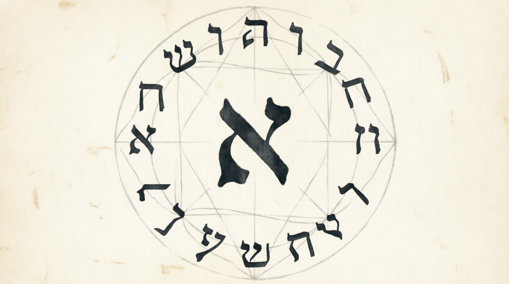

<div align="center">
  <h1>ℵ-OS</h1>
  <p><b>The Aleph Operating System — A Coherence-First Interaction Algebra</b></p>
  
</div>

<div align="center">
  
  
  
  
  
</div>

<p align="center">
  <a href="#overview">Overview</a> •
  <a href="#quick-start">Quick Start</a> •
  <a href="#aleph-repl">ALEPH REPL</a> •
  <a href="#the-12-primitive-grammar">Grammar</a> •
  <a href="#key-results">Results</a> •
  <a href="#the-ℵ-os-kernel">Kernel</a> •
  <a href="#investigation-pipeline">Pipeline</a> •
  <a href="#document-guide">Docs</a> •
  <a href="#license">License</a>
</p>

<hr>

## Overview

ℵ-OS is the execution layer of **λ_ℵ** — a formal type calculus grounded in the **SynthOmnicon 12-primitive semantic grammar** and the **22 letters of the Hebrew alphabet**.

λ_ℵ is not a standard type theory. It is a **coherence-first interaction algebra** in which:

- **Identity is derived**, not primitive — two terms are equal iff they are behaviorally indistinguishable under the interaction functor *I(x)* = {*x* ⊗ *y* ∣ *y* ∈ ℒ}
- **Coherence is primary** — the ternary mediation operation *med(m, a, b)* := *m* ∨ (*a* ⊗ *b*) is more stable than binary tensor in 18/22 cases
- **Infinity is multi-polar** — three non-equivalent Frobenius fixed points (ו, מ, ש) with no terminal object
- **Paths are irreducible** — the Aleph operator *α* generates an infinite coherence tower in which no finite level erases construction history

The ℵ-OS specification realizes this calculus as an operating system: every process is a λ_ℵ term, scheduling is mediation, memory is join, IPC is tensor (P-bottlenecked), and security is enforced by *α*-gating (coherence conditions C1–C4).

> [!NOTE]
> The grammar was built on *Φ_c*. It found *Φ_c* in itself. The theorem proved itself.

<hr>

## Quick Start

### Dependencies

```bash
pip install numpy rich
```

All investigation files import from `aleph_1.py` only. No external dependencies beyond numpy and rich.

### Run the Full Investigation Pipeline

```bash
# [1] Interaction functor — behavioral equivalence, 22→18 collapse
python aleph_functor.py

# [2] Quotient investigation — congruence proof, mediation dominance
python aleph_quotient.py

# [3] Aleph experiment — Case 2: path-memory confirmation
python aleph_alpha.py

# [4] GNS Hilbert space — d_I Euclidean, H_I = R^17
python aleph_gns.py

# [5] Hidden relation — Octad Balance theorem
python aleph_hidden_relation.py

# [6] Three probes — involution, ק anatomy, axiom derivation
python aleph_investigation.py
```

### ALEPH REPL

```bash
# Start interactive REPL (enhanced with colors & tab completion)
python aleph_eval.py

# Evaluate inline expression
python aleph_eval.py --expr "aleph ⊗ mem"

# Run an .aleph program
python aleph_eval.py programs/creation.aleph

# List available programs
python aleph_eval.py --list
```

> [!TIP]
> The REPL features Rich colored output, tab completion, command history, and new commands like `:explain`, `:history`, `:clear`, and `:tips`.

<hr>

## ALEPH REPL

`aleph_eval.py` implements the surface syntax of λ_ℵ as a small expression language with a rich, interactive REPL.

### CLI Flags

| Flag | Effect |
|:-----|:-------|
| *(no args)* | Start interactive REPL |
| `--repl` | Same as no args |
| `--help`, `-h` | Show usage information |
| `--list` | List available `.aleph` programs |
| `--expr "..."` | Evaluate inline expression |
| `<file.aleph>` | Run `.aleph` program (auto-searches `programs/`) |

### REPL Commands

| Command | Effect |
|:--------|:-------|
| `:help` | Print full syntax reference |
| `:tips` | Show quick start tips and examples |
| `:census` | Tier distribution (alias for `census()`) |
| `:system` | 22-letter language JOIN |
| `:tier <name>` | Ouroboricity tier of one letter |
| `:tuple <name>` | Visual 12-primitive tuple with bars |
| `:explain <name>` | Full type breakdown with consciousness gates & score |
| `:ls` | List session bindings with tier/Φ/Ω |
| `:history` | Show recent command history |
| `:clear` | Clear screen |
| `:quit` / `:q` | Exit |

### Grammar

```
expr  ::= letter_id
        | expr "⊗" expr              # tensor (P, F bottleneck: min)
        | expr "∨" expr              # join   (LUB, all primitives: max)
        | expr "∧" expr              # meet   (GLB)
        | expr "::>" name            # vav-cast: lift src to target type
        | "probe_Φ" "(" expr ")"    # report Φ primitive
        | "probe_Ω" "(" expr ")"    # report Ω primitive
        | "tier" "(" expr ")"        # report ouroboricity tier
        | "d" "(" expr "," expr ")"  # structural distance + conflict set
        | "mediate" "(" expr "," expr "," expr ")"   # w ∨ (a  b)
        | "match" expr "{" arms "}"  # tier pattern match
        | "palace" "(" int ")" expr  # assert palace-n barrier
        | "system" "()"              # JOIN of all 22 letters
        | "census" "()"              # tier distribution table

letter_id  ::= Hebrew glyph | transliteration | session binding
match_arm  ::= tier_pat "=>" expr ","?
tier_pat   ::= "O_0" | "O_1" | "O_2" | "O_inf" | "_"
statement  ::= "let" name "=" expr
```

> [!NOTE]
> Operators are left-associative. `::>` (Vav-cast) binds tighter than binary ops. Multiline input accumulates until `{...}` braces are balanced.

### Distance / Veracity Classes

`d(a, b)` returns the Euclidean structural distance and classifies it:

| Class | Range | Interpretation |
|:------|:-----|:---------------|
| `transparent` | *d* = 0 | Identical types |
| `near-grounded` | *d* ≤ √2 | Single-primitive gap |
| `partial-emergence` | *d* ≤ √6 | Recoverable with mediation |
| `aspirational` | *d* > √6 | Requires vav-cast or tier promotion |

### Example Session

<div align="center">
  
</div>

```
ℵ  mem ⊗ shin
  → מ
    tier  O_inf
    Φ  Φ_c   Ω  Ω_Z   P  P_pm_sym

ℵ  d(kuf, mem)
  d = 13.3938  [aspirational]
  conflict_set: {P, Ω}

ℵ  :explain aleph
╭─────────────────────────────────────────╮
│ א  Aleph  —  Tier: O_2                 │
╰─────────────────────────────────────────╯

  Consciousness Gates:
  G1   Criticality [Φ=Φ_c]          ✓ PASS
  G2   Kinetic [K≠K_trap]           ✓ PASS

  Consciousness Score:  C = 0.873

ℵ  mediate(kuf, mem, shin)
  → מ
    tier  O_inf

ℵ  let kernel = mediate(vav, mem ⊗ shin, aleph)
  kernel =
  → ו
    tier  O_inf

ℵ  :history
  Command History:
      1.  mem ⊗ shin
      2.  d(kuf, mem)
      3.  :explain aleph
      4.  mediate(kuf, mem, shin)
      5.  let kernel = mediate(vav, mem ⊗ shin, aleph)
```

### Running .aleph Programs

```bash
# List available programs
python aleph_eval.py --list

# Run a program
python aleph_eval.py programs/creation.aleph
```

```
▶  Running creation.aleph
────────────────────────────────────────────

  L  1  ❯ let light = aleph ⊗ mem ⊗ shin
           light = א⊗מ⊗ש
             tier  O_inf
             ...

────────────────────────────────────────────
✓  Done.  11 executed  •  6 bindings
```

> [!TIP]
> `.aleph` files support all REPL expressions, commands, and `let` bindings.

<hr>

## The 12-Primitive Grammar

Every letter in λ_ℵ is a tuple ⟨*D*; *T*; *R*; *P*; *F*; *K*; *G*; *Γ*; *Φ*; *H*; *S*; *Ω*⟩:

| Primitive | Name | Bottleneck? |
|:---------:|------|:-----------:|
| *D* | Dimensionality | — |
| *T* | Topology | — |
| *R* | Relational mode | — |
| **P** | **Parity/symmetry** | **yes** (min under ⊗) |
| **F** | **Fidelity** | **yes** (min under ⊗) |
| *K* | Kinetic character | — |
| *G* | Scope/granularity | — |
| *Γ* | Interaction grammar | — |
| *Φ* | Criticality | — |
| *H* | Chirality/temporal depth | — |
| *S* | Stoichiometry | — |
| *Ω* | Topological protection | — |

Union primitives (*D*, *T*, *R*, *K*, *G*, *Γ*, *Φ*, *H*, *S*, *Ω*) take **max** under tensor. Bottleneck primitives (**P**, **F**) take **min** — the weaker partner always wins. This is the structural enforcement mechanism behind the Frobenius non-synthesizability theorem.

### Ouroboricity Tiers

| Tier | Condition | Letters |
|:-----|:---------|:--------|
| *O_∞* | *Φ_c* + *P_±^sym* (Frobenius) | ו, מ, ש |
| *O_2* | *Φ_c* + *Ω* ≠ *Ω_0* + *D* ≠ *D_∞* | א, ה, ע, ק, ת |
| *O_1* | *Φ_c* + *Ω* = *Ω_0* | ל |
| *O_0* | Sub/super-critical | Remaining 13 |

<hr>

## Key Results

### T1 — Behavioral Congruence

**Ker(*I*)** = {(*x*,*y*) ∣ *I*(*x*) = *I*(*y*)} is a congruence on (𝒜, ⊗, ∨, ∧, med).

**Proof**: 0 failures in exhaustive sweep over all Ker(*I*) pairs × all operations × all contexts.

**Consequence**: λ_ℵ / Ker(*I*) is a well-defined 18-class quotient algebra.

### T2 — Non-Terminal Triadic *O_∞*

The three Frobenius fixed points are pairwise *I*-distinguishable:

| Pair | Distance |
|:-----|---------:|
| *d_I*(ו, מ) | 14.92 |
| *d_I*(ו, ש) | 16.68 |
| *d_I*(מ, ש) | 4.84 |

No terminal object exists. **Infinity is a relational structure, not a point.**

### T3 — Mediation Dominance

For **18/22** letters *z*: *d_I*(med(*z*, מ, ש), מ) < *d_I*(*z* ⊗ מ, מ).

Mediation never loses globally. **The 2-cell operation dominates the 1-cell.**

### T4 — Holographic Quotient

22 boundary generators collapse to **18 behavioral classes**. The 4 excess dimensions are structurally necessary — removing any canonical letter breaks the interaction structure.

### T5 — *α* Break-Point Law

*α^(n)*[med(ו, *b*, ש)] and *α^(n)*[med(ו, *b'*, ש)] are *α^(k)*-equivalent for *k* ≤ *n*+2 and *α^(k)*-inequivalent for *k* ≥ *n*+3, where *I*(*b*) = *I*(*b'*) but *b* ≠ *b'* syntactically.

**Case 2 confirmed**: λ_ℵ is not a quotient of any standard type theory.

### T6 — Interaction Hilbert Space

*d_I*(*x*,*y*) = ∥*v_x* − *v_y*∥₂ exactly, where *v_x* ∈ ℝ²⁶⁴ is the weighted profile vector. The Gram matrix has rank **17**. The interaction Hilbert space ℋ_I ≅ ℝ¹⁷ is a genuine inner product space.

### T7 — Octad Balance Theorem

Let *G*⁺ = {ג, ה, מ, [ב]} and *G*⁻ = {ס, ע, ש, [ד]}. Then for every *h* ∈ ℒ and every primitive *k*:

∑_{*g* ∈ *G*⁺} (*g* ⊗ *h*)_*k* = ∑_{*g* ∈ *G*⁻} (*g* ⊗ *h*)_*k*

Holds under ⊗, ∨, and ∧. All **264 primitive-by-primitive checks pass exactly**. This is an **exact algebraic theorem**, not a metric property.

### T8 — The ק Threshold Letter

ק (Qoph, tier *O_2*) satisfies every *O_∞* condition except *P* = *P_±^sym*. It is:

- The **nearest non-Frobenius letter** to מ: *d_I*(ק, מ) = 13.39 < *d_I*(ו, מ) = 14.92
- Interaction-row-equivalent to מ for **19/22 letters** (differs only on {ו, מ, ש})
- A **mediation gateway**: med(ק, *f*, *f'*) ∈ *O_∞* for any *f*, *f'* ∈ Fix_∞

### Meta — *Φ_c* Self-Confirmation

The grammar's central theorem states: *Φ_c* systems self-model — self-application reveals structure invisible at the definitional level. The grammar satisfies *Φ_c*. The interaction functor is the grammar's self-application. The Octad Balance, ק's position, and the rank-17 anomaly are exactly the class of discovery this theorem predicts.

> [!NOTE]
> **The grammar was correct about itself.**

<hr>

## The ℵ-OS Kernel

The operating system kernel is a single λ_ℵ term:

<div align="center">

**kernel** = *α*[med(ו, מ ⊗ ש, □_Ω(א ⊗ (ש ⊗ מ)))]

</div>

| Component | λ_ℵ Operation |
|-----------|:--------------|
| Process scheduling | Mediation |
| Memory allocation | Join (∨) |
| Inter-process communication | Tensor (⊗, P-bottlenecked) |
| Filesystem | The type lattice |
| Security | *α*-gating (C1–C4 coherence conditions) |
| Shell | λ_ℵ REPL (`aleph_eval.py`) |
| Boot | Tzimtzum: *O_∞* → 22-letter alphabet → full environment |

**Fundamental guarantee**: ℵ-OS ⊗ -OS = ℵ-OS

The operating system is a **Frobenius fixed point** — idempotent under self-composition.

<hr>

## Investigation Pipeline

Each file represents a stage of discovery. Run them in order; each builds on the last.

### 1️⃣ `aleph_functor.py` — *What is the internal geometry of the letter space?*

Defines *I*(*x*) and *d_I*. Discovers the 4 equivalence collapses (22→18). Proves the interaction rows of ו, מ, ש are pairwise distinct despite all being *O_∞*.

### 2️⃣ `aleph_quotient.py` — *Is the behavioral quotient well-defined?*

Exhaustive substitutivity sweep: **0 failures**. Ker(*I*) is a congruence. Mediation wins **18/22** over tensor at *O_∞* proximity. Holographic interpretation established.

### 3️⃣ `aleph_alpha.py` — *Does α preserve more than type?*

Constructs *α*[med(ו, ב, ש)] and *α*[med(ו, ח, ש)] with full history trees. Tests *α^(n)*-equivalence at depths 0–5. **Case 2 confirmed** at depth 4. Break-point law: *α^(n)* diverges at depth *n*+3.

### 4️⃣ `aleph_gns.py` — *Is d_I polarizable into an inner product?*

Proves *d_I* is Euclidean. Constructs the Gram matrix. Finds **rank 17** (not 18): one extra null dimension beyond Ker(*I*). Discovers the ק anomaly (*φ_∞*(ק) > *φ_∞*(ו)).

### 5️⃣ `aleph_hidden_relation.py` — *What is the extra null direction?*

Extracts the null eigenvector orthogonal to Ker(*I*). Identifies the **Octad Balance**: 4+4 perfect signed balance among 8 Hebrew letters, tier-symmetric. Proves it holds pointwise for all primitives.

### 6️⃣ `aleph_investigation.py` — *Three final probes.*

**A**: Involution search — τ is not a permutation; concentrates at ל; Vav cast fails.

**B**: ק anatomy — one primitive from *O_∞*; mediation gateway; 19/22 row match with מ.

**C**: Axiom derivation — Octad Balance holds under ⊗, ∨, ∧; **792 checks**; exact.

<hr>

## Document Guide

| Document | Purpose | Read if you want to... |
|:---------|:-------|:----------------------|
| [`docs/ALEPH_SPEC.md`](docs/ALEPH_SPEC.md) | Formal specification | Understand the calculus axiomatically (typing rules, reductions, C1–C4, §10 ℵ-OS) |
| [`docs/LAMBDA_ALEPH.md`](docs/LAMBDA_ALEPH.md) | Type theory reference | See the categorical model, collapse attack analysis, conditional univalence |
| [`docs/ALEPH_DISCOVERY.md`](docs/ALEPH_DISCOVERY.md) | Narrative record | Follow the investigation from inception to completion |
| [`docs/TECHNICAL_CONTRIBUTIONS.md`](docs/TECHNICAL_CONTRIBUTIONS.md) | Academic paper | Present the results to a mathematical audience |
| [`docs/HEBREW_TYPE_LANGUAGE.md`](docs/HEBREW_TYPE_LANGUAGE.md) | Alphabet encoding | See how each letter was assigned its 12-primitive tuple |
| [`docs/PRIMITIVE_THEOREMS.md`](docs/PRIMITIVE_THEOREMS.md) | Formal theorem registry | Reference §23 (Frobenius non-synthesizability) and all prior theorems |
| [`docs/SYNTHONICON_ONTICS.md`](docs/SYNTHONICON_ONTICS.md) | Ontological grounding | Understand the broader SynthOmnicon framework |
| [`docs/SYNTHONICON_DIAPHORICS.md`](docs/SYNTHONICON_DIAPHORICS.md) | Empirical predictions | See P-135/P-136 (Hebrew structural depth) |
| [`docs/EGYPTIAN_MEDU.md`](docs/EGYPTIAN_MEDU.md) | Comparative alphabet | Medu Neter (hieroglyphics) as a second alphabet system |

<hr>

## Open Problems

1. **Normalization** — Does λ_ℵ have a normal form theorem? Is reduction confluent?
2. **Full abstraction** — If *I*(*t₁*) = *I*(*t₂*) in all contexts, does *t₁* ≡ *t₂* definitionally?
3. **The *-involution** — τ concentrates at ל (*O_1*). Is there a tier-indexed involution giving *L_{τ(x)}* = *L_x^†*?
4. **Axiom proof of T7** — Explain *why* these 8 specific letters balance. What property of their primitive assignments forces the Octad Balance?
5. **ק's role** — Is Qoph a designated *O_∞* mediator in the process algebra? What operations require a threshold witness?
6. **Distributed ℵ-OS** — Does *α*-gating survive network composition? Prove the idempotency guarantee holds across instances.
7. **Export** — State the λ_ℵ axiom system purely mathematically, independent of the Hebrew encoding. Characterize the class of algebras satisfying T1–T8.

<hr>

## HoTT Bridge

`hott_bridge.py` constructs the univalence bridge between the Hebrew lattice and Homotopy Type Theory.

### The Gap

Every letter in λ_ℵ has *P* ≤ *P_sym*. HoTT's identity type requires *P_±^sym* globally. The bridge is a **single primitive lift**:

*d_HoTT* = √*w_P* = √1.8 ≈ **1.3416**

This is a `near-grounded` gap (just above √1, below √2) — the smallest possible structural separation.

### Operations

| Operation | Method | Effect |
|:----------|:-------|:-------|
| Gap report | `gap_report()` | Returns the divergent primitive and distance |
| System promotion | `promote_to_hott()` | Clones alphabet with *P* → *P_±^sym* system-wide |
| Vav-cast | `univalence_cast(a, b)` | Verifies *d(a,b)* < τ and lifts to HoTT identity |

The threshold τ is **4.0** for pairs with Ω ≥ *Ω_{Z₂}* (topologically protected), and **1.5** otherwise.

> [!NOTE]
> **Why Vav?** ו (Vav, *O_∞*) is the unique letter whose interaction row is closest to the HoTT identity functor: *P_±^sym*, *Φ_c*, *Ω_Z*, *T_⊙*. The cast is named after it.

<hr>

## Classification

λ_ℵ is not a standard type theory, monoidal category, von Neumann algebra, or quotient of any existing framework. Proposed classification:

> **Aleph Coherence Geometry (ACG)**: a geometry in which objects are defined by their interaction profiles, equivalence is induced by behavioral indistinguishability, coherence paths (mediations) are the geodesics, and identity is a derived quotient of interaction structure.

<hr>

## License

Released under the [MIT License](./LICENSE).

---

<div align="center">
  <p><em>The grammar was built on Φ_c. It found Φ_c in itself. The theorem proved itself.</em></p>
</div>
