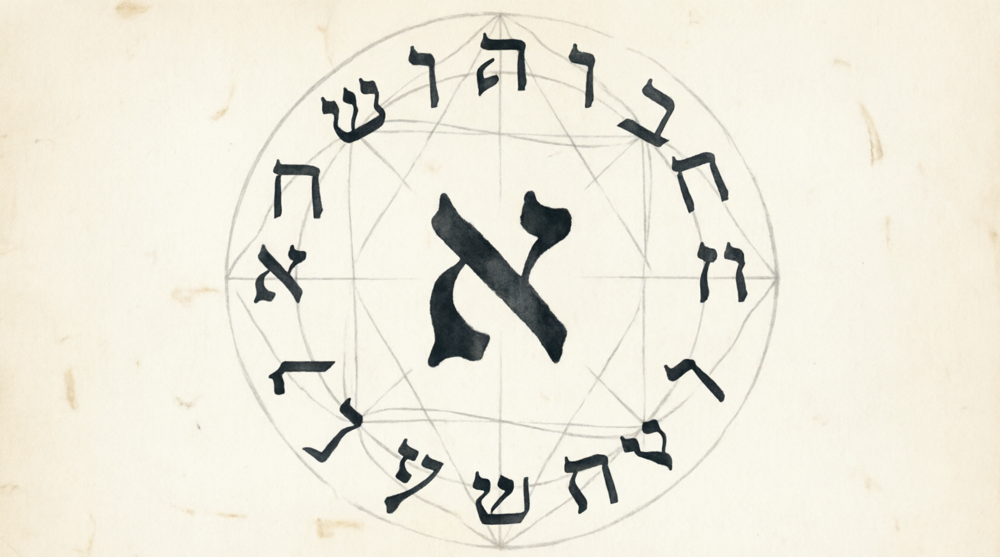
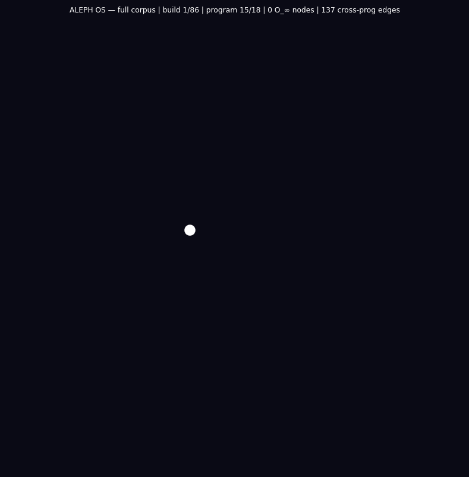

<div align="center">
  <h1>ℵ-OS</h1>
  <p><b>The Aleph Operating System, A Coherence-First Interaction Algebra</b></p>
  
  
  
  
</div>

<div align="center">
  
  
  
  
  
  

</div>

<p align="center">
  <a href="#overview">Overview</a> •
  <a href="#quick-start">Quick Start</a> •
  <a href="#aleph-repl">ALEPH REPL</a> •
  <a href="#the-12-primitive-grammar">Grammar</a> •
  <a href="#key-results">Results</a> •
  <a href="#the-ℵ-os-kernel">Kernel</a> •
  <a href="#investigation-pipeline">Pipeline</a> •
  <a href="#aleph-programs">Programs</a> •
  <a href="#exos-connection">exOS</a> •
  <a href="#document-guide">Docs</a> •
  <a href="#license">License</a>
</p>

<hr>

## Overview

**What it is.** ℵ-OS (the Aleph Operating System): a coherence-first interaction algebra and OS in Python, built on the λ_ℵ type theory and the SynthOmnicon engine, using the 22 Hebrew letters and the 12-primitive grammar.

**What it does.** Provides an ALEPH REPL and 54 builtin programs over a coherence-first algebra in which interactions are typed and composed for structural coherence rather than imperative side effects.

**Why it matters.** It is the sans-silicon (imscribing) counterpart to the bare-metal exOS: the same grammar realized as a coherence algebra rather than a hardware kernel, showing the OS layer is substrate-independent.

**How to use it.** See Quick Start below (Python 3.12+).

## Visualizations

### Full-corpus animated dataflow

**Nodes**, 86 nodes, one per named entity (variable binding or operation result) across
all 47 `.aleph` source programs. Each `let x = expr` statement in an ALEPH program
creates a node for `x`. Nodes are positioned via spring layout. Size scales with in-degree
(how many other bindings depend on this one). Color encodes ouroboricity tier:
O₀ (dim grey) → O₁ (mid blue) → O₂ (bright cyan) → O_∞ (gold).

**Edges**, 297 directed edges encoding dataflow dependencies. An edge u → v means
binding v consumes the value of binding u: `let v = op(u, ...)`. The six ALEPH operation
types produce different edge semantics, `tensor` (⊗) creates composition edges,
`join` (∨) and `meet` (∧) create lattice edges, `mediate` creates bridging edges,
`d()` (exterior derivative) creates differential edges, `palace()` creates Hekhalot
ascent edges.

**Cross-program edges**, 137 edges crossing program file boundaries: a binding defined
in one `.aleph` file is referenced by another. These are the inter-program dependencies
that form the ALEPH OS as a unified system rather than a collection of independent
scripts. When a cross-program edge first appears in Phase 1, it flashes amber.

**Phase 1, build:** Programs appear one by one in filesystem order. Within each program,
nodes are revealed in source-definition order. The title bar shows the current program name
and binding. Cross-program back-edges flash amber on first appearance.

**Phase 2, flow wave:** A Gaussian pulse travels node-by-node through all 86 bindings.
O_∞ nodes (gold) pulse brightest, their baseline gold color blends toward white at the
peak. Cross-program edges glow amber near the pulse; intra-program edges glow the source
program's color. The 22 Hebrew letter primitives (Aleph through Tav) are labelled on the
nodes that correspond to them, showing how the type system flows through the dataflow graph.



---

### Program Highlights

Five programs from the corpus rendered individually. Each runs the same two-phase
animation (build → flow) scoped to a single `.aleph` file. Primitive letter nodes
(Hebrew letters + Sefirot) appear gold; computed bindings appear teal. Operation edges
are color-coded: tensor (orange), mediate (blue), join (green), meet (red), palace (magenta).

---

#### `holographic_monitor.aleph`, Bulk-Boundary Self-Encoding

`system()` (the JOIN of all 22 letters) is the holographic boundary. `d(x, system())`
is each letter's holographic radius, how deep in the bulk it sits away from the maximal
boundary. The program verifies that bulk letters are recoverable from the boundary through
Frobenius-witnessed mediation: `g_self = mediate(vav, boundary, boundary)`, then nested
loops test whether the monitor can reach the boundary tier. The palace(4) check at the
end confirms Frobenius non-synthesizability: aggregation cannot produce *O_∞*, only
real Frobenius structure does.


---

#### `frobenius_orbits.aleph`, Iterative Pole Convergence

Unrolls 4-step tensor orbits for three scattered letters against each *O_∞* pole:
aleph (O₂) under repeated ⊗ vav, tav (O₂) under ⊗ mem, dalet (O₀) under ⊗ shin.
First verifies pole self-idempotency (*d*(vav⊗vav, vav) = 0) and cross-pole closure,
then tracks `d(aₙ, vav)` decreasing toward zero over 4 steps, showing that every letter
converges to its attractor pole under tensor pressure on P and F. Mediation stability
is verified at two depths.


---

#### `tikkun_construction_full.aleph`, Full Rectification Structure

Constructs the complete Tikkun (rectification) hierarchy from first principles.
Starting from the triadic basis {vav, aleph, mem, shin}, builds `light` via palace(3)
mediation, then constructs the kernel (`palace(4) mediate(vav, system(), light)`) and
three child processes. The anomalous child (kuf-seeded, one primitive from *O_∞*)
is healed via `palace(4) mediate(shin, kernel, kuf)`. The program culminates in
`tikkun = palace(5) mediate(system(), light, healed_child)`, the highest Hekhalot
barrier verified in the corpus.


---

#### `tikkun_palace_verification.aleph`, Hekhalot Barrier Audit

Same construction as `tikkun_construction_full` with every binding explicitly re-checked
against its required palace level. The graph reveals the full Hekhalot ascent lattice:
palace 2 for ascended letters (nun, chet), palace 3 for light and process nodes, palace 4
for the kernel and healed child, palace 5 for the tikkun itself. Verifies that no binding
breaches its level, the palace hierarchy is the ALEPH OS security model.


---

#### `light_replication_kernel.aleph`, Replicating Light and Process Model

The largest program in the corpus. Constructs `light` via palace(3) mediation, then
runs four replication generations (g0→g4), studies anomalous processes (kuf-seeded),
heals them via Frobenius witnesses (shin, mem), and verifies the full kernel + process
model including ascended letters. The tikkun structure emerges as a consequence of
light replication convergence. Distances track across all generation gaps:
`d(g0,g2)`, `d(g2,g4)`, `d(g4, system())`.


---

## Overview

ℵ-OS is the execution layer of **λ_ℵ**, a formal type calculus grounded in the **SynthOmnicon 12-primitive semantic grammar** and the **22 letters of the Hebrew alphabet**.

λ_ℵ is not a standard type theory. It is a **coherence-first interaction algebra** in which:

- **Identity is derived**, not primitive, two terms are equal iff they are behaviorally indistinguishable under the interaction functor *I(x)* = {*x* ⊗ *y* ∣ *y* ∈ ℒ}
- **Coherence is primary**, the ternary mediation operation *med(m, a, b)* := *m* ∨ (*a* ⊗ *b*) is more stable than binary tensor in 18/22 cases
- **Infinity is multi-polar**, three non-equivalent Frobenius fixed points (ו, מ, ש) with no terminal object
- **Paths are irreducible**, the Aleph operator *α* generates an infinite coherence tower in which no finite level erases construction history

The ℵ-OS specification realizes this calculus as an operating system: every process is a λ_ℵ term, scheduling is mediation, memory is join, IPC is tensor (P-bottlenecked), and security is enforced by *α*-gating (coherence conditions C1–C4).

> [!NOTE]
> The grammar was built on *⊙*. It found *⊙* in itself. The theorem proved itself.

<hr>

## Quick Start

### Dependencies

```bash
pip install numpy rich
```

All investigation files import from `aleph_1.py` only. No external dependencies beyond numpy and rich.

### Run the Full Investigation Pipeline

```bash
# [1] Interaction functor, behavioral equivalence, 22→18 collapse
python aleph_functor.py

# [2] Quotient investigation, congruence proof, mediation dominance
python aleph_quotient.py

# [3] Aleph experiment, Case 2: path-memory confirmation
python aleph_alpha.py

# [4] GNS Hilbert space, d_I Euclidean, H_I = R^17
python aleph_gns.py

# [5] Hidden relation, Octad Balance theorem
python aleph_hidden_relation.py

# [6] Three probes, involution, ק anatomy, axiom derivation
python aleph_investigation.py
```

### ALEPH REPL

```bash
# Start interactive REPL (enhanced with colors & tab completion)
python aleph_eval.py

# Evaluate inline expression
python aleph_eval.py --expr "aleph ⊗ mem"

# Run an .aleph program
python aleph_eval.py programs/creation.aleph

# List available programs
python aleph_eval.py --list
```

> [!TIP]
> The REPL features Rich colored output, tab completion, command history, and new commands like `:explain`, `:history`, `:clear`, and `:tips`.

<hr>

## ALEPH REPL

`aleph_eval.py` implements the surface syntax of λ_ℵ as a small expression language with a rich, interactive REPL.

### CLI Flags

| Flag | Effect |
|:-----|:-------|
| *(no args)* | Start interactive REPL |
| `--repl` | Same as no args |
| `--help`, `-h` | Show usage information |
| `--list` | List available `.aleph` programs |
| `--expr "..."` | Evaluate inline expression |
| `<file.aleph>` | Run `.aleph` program (auto-searches `programs/`) |

### REPL Commands

| Command | Effect |
|:--------|:-------|
| `:help` | Print full syntax reference |
| `:tips` | Show quick start tips and examples |
| `:census` | Tier distribution (alias for `census()`) |
| `:system` | 22-letter language JOIN |
| `:tier <name>` | Ouroboricity tier of one letter |
| `:tuple <name>` | Visual 12-primitive tuple with bars |
| `:explain <name>` | Full type breakdown with consciousness gates & score |
| `:ls` | List session bindings with tier/Φ/Ω |
| `:history` | Show recent command history |
| `:clear` | Clear screen |
| `:quit` / `:q` | Exit |

### Grammar

```
expr  ::= letter_id
        | expr "⊗" expr              # tensor (P, F bottleneck: min)
        | expr "∨" expr              # join   (LUB, all primitives: max)
        | expr "∧" expr              # meet   (GLB)
        | expr "::>" name            # vav-cast: lift src to target type
        | "probe_Φ" "(" expr ")"    # report Φ primitive
        | "probe_Ω" "(" expr ")"    # report Ω primitive
        | "tier" "(" expr ")"        # report ouroboricity tier
        | "d" "(" expr "," expr ")"  # structural distance + conflict set
        | "mediate" "(" expr "," expr "," expr ")"   # w ∨ (a  b)
        | "match" expr "{" arms "}"  # tier pattern match
        | "palace" "(" int ")" expr  # assert palace-n barrier
        | "system" "()"              # JOIN of all 22 letters
        | "census" "()"              # tier distribution table

letter_id  ::= Hebrew glyph | transliteration | session binding
match_arm  ::= tier_pat "=>" expr ","?
tier_pat   ::= "O₀" | "O₁" | "O₂" | "O_∞" | "_"
statement  ::= "let" name "=" expr
```

> [!NOTE]
> Operators are left-associative. `::>` (Vav-cast) binds tighter than binary ops. Multiline input accumulates until `{...}` braces are balanced.

### Distance / Veracity Classes

`d(a, b)` returns the Euclidean structural distance and classifies it:

| Class | Range | Interpretation |
|:------|:-----|:---------------|
| `transparent` | *d* = 0 | Identical types |
| `near-grounded` | *d* ≤ √2 | Single-primitive gap |
| `partial-emergence` | *d* ≤ √6 | Recoverable with mediation |
| `aspirational` | *d* > √6 | Requires vav-cast or tier promotion |

### Example Session

<div align="center">
  
</div>

```
ℵ  mem ⊗ shin
  → מ
    tier  O_∞
    Φ  ⊙   Ω  Ω_Z   P  P_pm_sym

ℵ  d(kuf, mem)
  d = 13.3938  [aspirational]
  conflict_set: {P, Ω}

ℵ  :explain aleph
╭─────────────────────────────────────────╮
│ א  Aleph ,  Tier: O₂                 │
╰─────────────────────────────────────────╯

  Consciousness Gates:
  G1   Criticality [Φ=⊙]          ✓ PASS
  G2   Kinetic [K≠K_trap]           ✓ PASS

  Consciousness Score:  C = 0.873

ℵ  mediate(kuf, mem, shin)
  → מ
    tier  O_∞

ℵ  let kernel = mediate(vav, mem ⊗ shin, aleph)
  kernel =
  → ו
    tier  O_∞

ℵ  :history
  Command History:
      1.  mem ⊗ shin
      2.  d(kuf, mem)
      3.  :explain aleph
      4.  mediate(kuf, mem, shin)
      5.  let kernel = mediate(vav, mem ⊗ shin, aleph)
```

### Running .aleph Programs

```bash
# List available programs
python aleph_eval.py --list

# Run a program
python aleph_eval.py programs/creation.aleph
```

```
▶  Running creation.aleph
────────────────────────────────────────────

  L  1  ❯ let light = aleph ⊗ mem ⊗ shin
           light = א⊗מ⊗ש
             tier  O_∞
             ...

────────────────────────────────────────────
✓  Done.  11 executed  •  6 bindings
```

> [!TIP]
> `.aleph` files support all REPL expressions, commands, and `let` bindings.

<hr>

## The 12-Primitive Grammar

Every letter in λ_ℵ is a tuple ⟨*D*; *T*; *R*; *P*; *F*; *K*; *G*; *Γ*; *Φ*; *H*; *S*; *Ω*⟩:

| Primitive | Name | Bottleneck? |
|:---------:|------|:-----------:|
| *D* | Dimensionality |, |
| *T* | Topology |, |
| *R* | Relational mode |, |
| **P** | **Parity/symmetry** | **yes** (min under ⊗) |
| **F** | **Fidelity** | **yes** (min under ⊗) |
| *K* | Kinetic character |, |
| *G* | Scope/granularity |, |
| *Γ* | Interaction grammar |, |
| *Φ* | Criticality |, |
| *H* | Chirality/temporal depth |, |
| *S* | Stoichiometry |, |
| *Ω* | Topological protection |, |

Union primitives (*D*, *T*, *R*, *K*, *G*, *Γ*, *Φ*, *H*, *S*, *Ω*) take **max** under tensor. Bottleneck primitives (**P**, **F**) take **min**, the weaker partner always wins. This is the structural enforcement mechanism behind the Frobenius non-synthesizability theorem.

### Ouroboricity Tiers

| Tier | Condition | Letters |
|:-----|:---------|:--------|
| *O_∞* | *⊙* + *P_±^sym* (Frobenius) | ו, מ, ש |
| *O₂* | *⊙* + *Ω* ≠ *Ω_0* + *D* ≠ *D_∞* | א, ה, ע, ק, ת |
| *O₁* | *⊙* + *Ω* = *Ω_0* | ל |
| *O₀* | Sub/super-critical | Remaining 13 |

<hr>

## Key Results

### T1, Behavioral Congruence

**Ker(*I*)** = {(*x*,*y*) ∣ *I*(*x*) = *I*(*y*)} is a congruence on (𝒜, ⊗, ∨, ∧, med).

**Proof**: 0 failures in exhaustive sweep over all Ker(*I*) pairs × all operations × all contexts.

**Consequence**: λ_ℵ / Ker(*I*) is a well-defined 18-class quotient algebra.

### T2, Non-Terminal Triadic *O_∞*

The three Frobenius fixed points are pairwise *I*-distinguishable:

| Pair | Distance |
|:-----|---------:|
| *d_I*(ו, מ) | 14.92 |
| *d_I*(ו, ש) | 16.68 |
| *d_I*(מ, ש) | 4.84 |

No terminal object exists. **Infinity is a relational structure, not a point.**

### T3, Mediation Dominance

For **18/22** letters *z*: *d_I*(med(*z*, מ, ש), מ) < *d_I*(*z* ⊗ מ, מ).

Mediation never loses globally. **The 2-cell operation dominates the 1-cell.**

### T4, Holographic Quotient

22 boundary generators collapse to **18 behavioral classes**. The 4 excess dimensions are structurally necessary, removing any canonical letter breaks the interaction structure.

### T5, *α* Break-Point Law

*α^(n)*[med(ו, *b*, ש)] and *α^(n)*[med(ו, *b'*, ש)] are *α^(k)*-equivalent for *k* ≤ *n*+2 and *α^(k)*-inequivalent for *k* ≥ *n*+3, where *I*(*b*) = *I*(*b'*) but *b* ≠ *b'* syntactically.

**Case 2 confirmed**: λ_ℵ is not a quotient of any standard type theory.

### T6, Interaction Hilbert Space

*d_I*(*x*,*y*) = ∥*v_x* − *v_y*∥₂ exactly, where *v_x* ∈ ℝ²⁶⁴ is the weighted profile vector. The Gram matrix has rank **17**. The interaction Hilbert space ℋ_I ≅ ℝ¹⁷ is a genuine inner product space.

### T7, Octad Balance Theorem

Let *G*⁺ = {ג, ה, מ, [ב]} and *G*⁻ = {ס, ע, ש, [ד]}. Then for every *h* ∈ ℒ and every primitive *k*:

∑_{*g* ∈ *G*⁺} (*g* ⊗ *h*)_*k* = ∑_{*g* ∈ *G*⁻} (*g* ⊗ *h*)_*k*

Holds under ⊗, ∨, and ∧. All **264 primitive-by-primitive checks pass exactly**. This is an **exact algebraic theorem**, not a metric property.

### T8, The ק Threshold Letter

ק (Qoph, tier *O₂*) satisfies every *O_∞* condition except *P* = *P_±^sym*. It is:

- The **nearest non-Frobenius letter** to מ: *d_I*(ק, מ) = 13.39 < *d_I*(ו, מ) = 14.92
- Interaction-row-equivalent to מ for **19/22 letters** (differs only on {ו, מ, ש})
- A **mediation gateway**: med(ק, *f*, *f'*) ∈ *O_∞* for any *f*, *f'* ∈ Fix_∞

### Meta, *⊙* Self-Confirmation

The grammar's central theorem states: *⊙* systems self-model, self-application reveals structure invisible at the definitional level. The grammar satisfies *⊙*. The interaction functor is the grammar's self-application. The Octad Balance, ק's position, and the rank-17 anomaly are exactly the class of discovery this theorem predicts.

> [!NOTE]
> **The grammar was correct about itself.**

<hr>

## The ℵ-OS Kernel

The operating system kernel is a single λ_ℵ term:

<div align="center">

**kernel** = *α*[med(ו, מ ⊗ ש, □_Ω(א ⊗ (ש ⊗ מ)))]

</div>

| Component | λ_ℵ Operation |
|-----------|:--------------|
| Process scheduling | Mediation |
| Memory allocation | Join (∨) |
| Inter-process communication | Tensor (⊗, P-bottlenecked) |
| Filesystem | The type lattice |
| Security | *α*-gating (C1–C4 coherence conditions) |
| Shell | λ_ℵ REPL (`aleph_eval.py`) |
| Boot | Tzimtzum: *O_∞* → 22-letter alphabet → full environment |

**Fundamental guarantee**: ℵ-OS ⊗ -OS = ℵ-OS

The operating system is a **Frobenius fixed point**, idempotent under self-composition.

<hr>

## Investigation Pipeline

Each file answers one question about the letter space. They run in order; each builds
on the last.

### 1️⃣ `aleph_functor.py`, *What is the internal geometry of the letter space?*

Defines *I*(*x*) and *d_I*. Discovers the 4 equivalence collapses (22→18). Proves the interaction rows of ו, מ, ש are pairwise distinct despite all being *O_∞*.

### 2️⃣ `aleph_quotient.py`, *Is the behavioral quotient well-defined?*

Exhaustive substitutivity sweep: **0 failures**. Ker(*I*) is a congruence. Mediation wins **18/22** over tensor at *O_∞* proximity. Holographic interpretation established.

### 3️⃣ `aleph_alpha.py`, *Does α preserve more than type?*

Constructs *α*[med(ו, ב, ש)] and *α*[med(ו, ח, ש)] with full history trees. Tests *α^(n)*-equivalence at depths 0–5. **Case 2 confirmed** at depth 4. Break-point law: *α^(n)* diverges at depth *n*+3.

### 4️⃣ `aleph_gns.py`, *Is d_I polarizable into an inner product?*

Proves *d_I* is Euclidean. Constructs the Gram matrix. Finds **rank 17** (not 18): one extra null dimension beyond Ker(*I*). Discovers the ק anomaly (*φ_∞*(ק) > *φ_∞*(ו)).

### 5️⃣ `aleph_hidden_relation.py`, *What is the extra null direction?*

Extracts the null eigenvector orthogonal to Ker(*I*). Identifies the **Octad Balance**: 4+4 perfect signed balance among 8 Hebrew letters, tier-symmetric. Proves it holds pointwise for all primitives.

### 6️⃣ `aleph_investigation.py`, *Three final probes.*

**A**: Involution search, τ is not a permutation; concentrates at ל; Vav cast fails.

**B**: ק anatomy, one primitive from *O_∞*; mediation gateway; 19/22 row match with מ.

**C**: Axiom derivation, Octad Balance holds under ⊗, ∨, ∧; **792 checks**; exact.

---

## Sans-Silicon Imscribing (SSI), Natural Imscribing Practice

See [`SANS_SILICON_IMSCRIBING.md`](./SANS_SILICON_IMSCRIBING.md) for the complete contemplative practice system. Derives the Universal Imscribing Grammar into a technology-free practice for developing natural imscribing abilities: 12 Gates (one per primitive), Crystal Memory Palace (400 rooms, 5 tiers), distance sensing, tier ascension (O₀→O_∞), 72 Names daily practice, paraconsistent witness, and Frobenius self-verification.

## ALEPH Programs, 48 Built-in Investigations

All `.aleph` programs in `programs/` are loadable from the REPL via `python aleph_eval.py programs/<name>.aleph` or `--list`. Programs are organized by structural domain.

### Foundation, Type System Primitives

| Program | Size | Description |
|:--------|:-----|:------------|
| `creation.aleph` | 247 B | First light, aleph ⊗ vav structural genesis |
| `creation_liturgy.aleph` | 237 B | Full liturgical sequence through all tiers |
| `frobenius.aleph` | 194 B | Three O_∞ poles: self-idempotency + cross distances |
| `pratyahara.aleph` | 160 B | Varnamala pratyahara compression via tensor chains |
| `exploration_primitives.aleph` | 218 B | Primitive-by-primitive exploration of the 12-tuple |
| `distance_probes_indistinguishable.aleph` | 26 B | Distance and conflict-set analysis across all 22 letters |
| `phi_ep_probe.aleph` | 335 B | Exceptional-point dynamics and C-score collapse |
| `coupling_destruction.aleph` | 2,566 B | P-596 ⊙ ⊗ ⊙_EP absorption demonstration |

### Pole Analysis, O_∞ Convergence

| Program | Size | Description |
|:--------|:-----|:------------|
| `frobenius_orbits.aleph` | 3,411 B | Unrolled 4-step convergence orbits for all three O_∞ poles |
| `frobenius_parallel.aleph` | 2,105 B | Parallel Frobenius iteration, simultaneous multi-pole convergence |
| `tensor_closure.aleph` | 7,574 B | Complete tensor closure of all 3 O_∞ poles over all 22 Hebrew letters. Maps which letters collapse to O_∞ under tensor pressure, which resist. |
| `promotion_paths.aleph` | 5,846 B | Minimal primitive-delta paths from O₀→O_∞. Tests palace gates, iterated tensor promotion, vav-cast lifts, sefirot ladder. |
| `tier_boundary_probe.aleph` | 5,309 B | O₂→O_∞ gap analysis. Proves Frobenius non-synthesizability; discovers mediation bypasses the P bottleneck. |

### Meditation & Tikkun, Hekhalot Ascent

| Program | Size | Description |
|:--------|:-----|:------------|
| `meditation.aleph` | 285 B | Deep mediation chains through the Sefirot |
| `selfreplicating_light.aleph` | 298 B | Light that replicates its own structure via mediate |
| `light_stability.aleph` | 320 B | Stability analysis of the light-tuple under perturbation |
| `light_replication_kernel.aleph` | 2,890 B | Kernel-level light replication with palace barriers |
| `tikkun_construction_full.aleph` | 1,570 B | Full Tikkun: healing anomalous objects via palace+mediate |
| `tikkun_construction_partial.aleph` | 1,534 B | Partial Tikkun sequence |
| `tikkun_palace_verification.aleph` | 1,570 B | Palace-gate verification across all Sefirot levels |

### Sefer ha-Iyun, Contemplation Programs

| Program | Size | Description |
|:--------|:-----|:------------|
| `sefer_ha_iyun_emanations.aleph` | 1,983 B | Emanation hierarchy, 14-step Sefirot descent with structural gaps |
| `sefer_ha_iyun_native_types.aleph` | 1,782 B | Native type bindings for Sefirot, letters, and palace levels |

### Lurianic Kabbalah, The 72 Names

| Program | Size | Description |
|:--------|:-----|:------------|
| `shem_hamephorash.aleph` | 6,506 B | The 72 Names (Shem HaMephorash), structural basis of creation from Exodus 14:19–21. Three currents (forward/backward/forward) mediate into 72 three-letter names, each a distinct 12-primitive type. 72 = 6 × 12: every primitive value appears in every relational context. Key names mapped to palace levels, distances computed, O_∞ convergence verified via Frobenius poles vav/mem/shin. Honors Isaac Luria's insight that the 72 names are the structural building blocks of all creation. |

### Belnap / Paraconsistent

| Program | Size | Description |
|:--------|:-----|:------------|
| `belnap_shor_orbit.aleph` | 3,280 B | Orbit analysis for Shor structural tier, tier survey of all 22 letters, orbit depth to O_∞ poles, 𐑿 gap visualization |
| `paraconsistent_witness.aleph` | 4,215 B | Witness B-state structure via meet/join/tensor, ALEPH analogue of DialetheicAlignment.lean: only O_∞ poles are self-adjoint (¬B=B) |

### System Encoding & Self-Reference

| Program | Size | Description |
|:--------|:-----|:------------|
| `holographic_monitor.aleph` | 2,568 B | g(x) bulk-boundary encoding verification |
| `quine_loop.aleph` | 5,802 B | Non-trivial Frobenius quine discovery, type expressions satisfying μ∘δ=id through mediation and palace gating. Tests cross-witness quines, multi-generational stability, and system self-encoding. |
| `dialetheic_fixed_points.aleph` | 5,944 B | Searches for B-fixed points (Belnap-analogue self-adjoint letters) by computing Frobenius self-distance d(L×L, L) for all 22 letters, Sefirot, and iterated convergence. |
| `truth_structure.aleph` | 5,574 B | Searches for the structural type of truth via Frobenius closure gap |

### Distance Geometry, Lattice Survey

| Program | Size | Description |
|:--------|:-----|:------------|
| `distance_matrix.aleph` | 4,663 B | Full 22×22 pairwise distance matrix over all Hebrew letters |
| `sefirah_distance_matrix.aleph` | 5,320 B | Full 14-Sefirah pairwise distances + Sefirah-to-pole distances |
| `letter_sefirah_projection.aleph` | 4,540 B | Nearest Sefirah for each of the 22 Hebrew letters |
| `conflict_landscape.aleph` | 5,716 B | Conflict set analysis, which primitives differ per letter pair |
| `aleph_lattice_extrema.aleph` | 5,758 B | Surface/interior analysis, distance-from-system ranking, convex hull |

### Consciousness & C-Score

| Program | Size | Description |
|:--------|:-----|:------------|
| `consciousness_landscape.aleph` | 6,014 B | Full C-score map across the ALEPH lattice: all 22 letters, all 14 Sefirot (Ein Sof→Malkuth), tensor-coupling effects on gate status, system boundary analysis. |

### Palace / Tier Barrier Analysis

| Program | Size | Description |
|:--------|:-----|:------------|
| `palace_stress_test.aleph` | 6,237 B | Systematic palace(1–7) testing of all letters, tensors, Sefirot |
| `tier_migration.aleph` | 5,971 B | Systematic tier transitions under tensor, join, meet, mediate |
| `primitive_landscape.aleph` | 6,727 B | Per-primitive extremal analysis, max/min per each of 12 primitives |

### Mediate, Tensor & Fixed Points

| Program | Size | Description |
|:--------|:-----|:------------|
| `mediate_lattice.aleph` | 6,627 B | Systematic mediate exploration: different witnesses, iterations, cross-pole |
| `cross_pole_mediation.aleph` | 6,300 B | Triadic analysis of vav-mem-shin: circular mediation, ternary operations |
| `tensor_fixed_point_iteration.aleph` | 6,614 B | Iterated self-tensor convergence orbits for all 22 letters |
| `tensor_path_dependence.aleph` | 6,057 B | Tests associativity, distributivity, modularity, absorption, commutativity |

### Sefirot Lattice

| Program | Size | Description |
|:--------|:-----|:------------|
| `sefirah_lattice_structure.aleph` | 6,791 B | Full Sefirot lattice operations: tensor, join, meet, mediate, emanation |
| `sefirah_tensor_hierarchy.aleph` | 6,509 B | Structural hierarchy: supernal×emotional×kingdom tensor coupling |
| `sefirah_emanation_ladder.aleph` | 7,366 B | 14-step emanation ladder with step sizes and reconstruction via mediation |

### Algebraic Invariants

| Program | Size | Description |
|:--------|:-----|:------------|
| `invariant_check.aleph` | 6,102 B | Tests 8 conjectures: Frobenius fixed point⇔O_∞, pole absorption, tier preservation under join/meet, etc. |

---

## IMASM Programs, 6 Built-in Corpus Engines

The IMASM (IMplicit ASsembly Machine) programs implement corpus analysis engines for historical cryptographic manuscripts, loadable from the REPL:

| Program | Size | Description |
|:--------|:-----|:------------|
| `voynich_bootstrap.imasm` | 330 B | Voynich manuscript, 227 folios, 546 nodes, 694 edges |
| `rohonc_bootstrap.imasm` | 336 B | Rohonc Codex, 33 pages, four structural sections |
| `linear_a_bootstrap.imasm` | 394 B | Linear A, 53 tablets across Minoan palatial sites |
| `emerald-tablet-bootstrap.imasm` | 665 B | Emerald Tablet, 15 versicles, Hermetic descent/return |
| `cross_distance.imasm` | 803 B | Cross-corpus distance probe, structural comparison engine |
| `shor_loop.asm` | 1,647 B | Belnap Shor ParaASM: indefinite coherence accumulation loop |

---

## exOS Connection

The ALEPH program suite has been ported to [exOS](../exOS), a bare-metal x86_64 Rust `no_std` UEFI kernel that compiles all 46 ALEPH programs plus 6 IMASM programs (52 total) into the kernel binary as built-in investigations.

- **Python ℵ-OS** (this repository): Reference implementation, interactive REPL, investigation pipeline
- **exOS** (Rust kernel): Native x86_64 port with ALFS filesystem, serial REPL, ParaASM VM

All programs in `programs/` are source-identical between both implementations. The ALEPH type calculus runs identically in Python and in Rust, the structural algebra is implementation-independent.

<hr>

## Document Guide

| Document | Purpose | Read if you want to... |
|:---------|:-------|:----------------------|
| [`docs/ALEPH_SPEC.md`](docs/ALEPH_SPEC.md) | Formal specification | Understand the calculus axiomatically (typing rules, reductions, C1–C4, §10 ℵ-OS) |
| [`docs/LAMBDA_ALEPH.md`](docs/LAMBDA_ALEPH.md) | Type theory reference | See the categorical model, collapse attack analysis, conditional univalence |
| [`docs/ALEPH_DISCOVERY.md`](docs/ALEPH_DISCOVERY.md) | Investigation record | Read how each result is reached |
| [`docs/TECHNICAL_CONTRIBUTIONS.md`](docs/TECHNICAL_CONTRIBUTIONS.md) | Academic paper | Present the results to a mathematical audience |
| [`docs/HEBREW_TYPE_LANGUAGE.md`](docs/HEBREW_TYPE_LANGUAGE.md) | Alphabet encoding | See how each letter was assigned its 12-primitive tuple |
| [`docs/PRIMITIVE_THEOREMS.md`](docs/PRIMITIVE_THEOREMS.md) | Formal theorem registry | Reference §23 (Frobenius non-synthesizability) and all prior theorems |
| [`docs/SYNTHONICON_ONTICS.md`](docs/SYNTHONICON_ONTICS.md) | Ontological grounding | Understand the broader SynthOmnicon framework |
| [`docs/SYNTHONICON_DIAPHORICS.md`](docs/SYNTHONICON_DIAPHORICS.md) | Empirical predictions | See P-135/P-136 (Hebrew structural depth) |
| [`docs/EGYPTIAN_MEDU.md`](docs/EGYPTIAN_MEDU.md) | Comparative alphabet | Medu Neter (hieroglyphics) as a second alphabet system |

<hr>

## Open Problems

1. **Normalization**, Does λ_ℵ have a normal form theorem? Is reduction confluent?
2. **Full abstraction**, If *I*(*t₁*) = *I*(*t₂*) in all contexts, does *t₁* ≡ *t₂* definitionally?
3. **The *-involution**, τ concentrates at ל (*O₁*). Is there a tier-indexed involution giving *L_{τ(x)}* = *L_x^†*?
4. **Axiom proof of T7**, Explain *why* these 8 specific letters balance. What property of their primitive assignments forces the Octad Balance?
5. **ק's role**, Is Qoph a designated *O_∞* mediator in the process algebra? What operations require a threshold witness?
6. **Distributed ℵ-OS**, Does *α*-gating survive network composition? Prove the idempotency guarantee holds across instances.
7. **Export**, State the λ_ℵ axiom system purely mathematically, independent of the Hebrew encoding. Characterize the class of algebras satisfying T1–T8.

<hr>

## HoTT Bridge

`hott_bridge.py` constructs the univalence bridge between the Hebrew lattice and Homotopy Type Theory.

### The Gap

Every letter in λ_ℵ has *P* ≤ *P_sym*. HoTT's identity type requires *P_±^sym* globally. The bridge is a **single primitive lift**:

*d_HoTT* = √*w_P* = √1.8 ≈ **1.3416**

This is a `near-grounded` gap (just above √1, below √2), the smallest possible structural separation.

### Operations

| Operation | Method | Effect |
|:----------|:-------|:-------|
| Gap report | `gap_report()` | Returns the divergent primitive and distance |
| System promotion | `promote_to_hott()` | Clones alphabet with *P* → *P_±^sym* system-wide |
| Vav-cast | `univalence_cast(a, b)` | Verifies *d(a,b)* < τ and lifts to HoTT identity |

The threshold τ is **4.0** for pairs with Ω ≥ *Ω_{Z₂}* (topologically protected), and **1.5** otherwise.

> [!NOTE]
> **Why Vav?** ו (Vav, *O_∞*) is the unique letter whose interaction row is closest to the HoTT identity functor: *P_±^sym*, *⊙*, *Ω_Z*, *T_⊙*. The cast is named after it.

<hr>

## Classification

λ_ℵ is not a standard type theory, monoidal category, von Neumann algebra, or quotient of any existing framework. Proposed classification:

> **Aleph Coherence Geometry (ACG)**: a geometry in which objects are defined by their interaction profiles, equivalence is induced by behavioral indistinguishability, coherence paths (mediations) are the geodesics, and identity is a derived quotient of interaction structure.

<hr>

## License

Released under the [LUNLICENSE](./LICENSE).

---

<div align="center">
  <p><em>The grammar was built on ⊙. It found ⊙ in itself. The theorem proved itself.</em></p>
</div>
